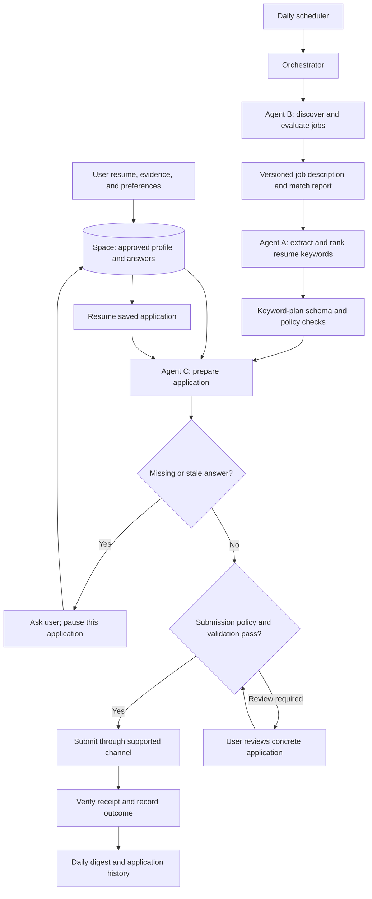

# Personal job application pipeline: implementation and operating plan

Status: proposed design for user review; no integrations, agents, scheduler, or applications have been activated.
Prepared: 2026-09-23.

Detailed execution backlog: [IMPLEMENTATION_TASK_LIST.md](./IMPLEMENTATION_TASK_LIST.md), including separate agent instruction files, skills, MCP tool contracts, model assignments, and phase completion checks. All remain proposed until implementation is authorized.

## 1. Objective and realistic outcome

Build a personal assistant that finds suitable jobs daily, explains why each is suitable, prepares a ranked keyword plan for that particular role so the user can tailor the resume manually, completes supported application forms, asks for missing information, and remembers approved answers for appropriate future reuse.

Optimize for precision and application quality before volume or speed. The user’s explicit preferences and factual history govern every stage.

The target is a stronger credible presentation of the candidate’s actual qualifications after manual review. No resume, keyword strategy, or agent can guarantee first place, a particular ATS score, an interview, or selection. Employer ranking methods and competing applicants are generally unknown. Our match score is an internal prioritization tool, not a prediction of an employer’s ranking.

## 2. What you need to prepare

| Input | What to provide | How it will be used |
| --- | --- | --- |
| Master resume | Current resume document | User-managed document, preserved unchanged |
| Career evidence | Accurate roles, dates, responsibilities, projects, tools, outcomes, education, certifications | Source material for defensible tailoring |
| Target roles | Preferred titles, acceptable alternatives, seniority, industries | Search and matching rules |
| Work preferences | Cities, remote/hybrid/on-site, relocation, travel, shifts, employment type | Hard filters or weighted preferences, as you choose |
| Compensation | Minimum and target, currency, annual/monthly basis, fixed/variable expectations, disclosure preference | Filtering and context-specific answers |
| Availability | Notice period, negotiability, earliest joining date | Application answers with freshness checks |
| Eligibility | Work authorization and sponsorship needs for relevant countries | Required eligibility answers without inference |
| Exclusions | Companies, roles, industries, agencies, contract types, other deal-breakers | Explicit rejection rules |
| Links | Portfolio, GitHub, professional profile, work samples you want shared | Application assets |
| Application history | Roles already applied to, withdrawn, rejected, or in progress | Duplicate prevention |
| Operating preferences | Daily application cap, schedule, timezone, budget, notification channel | Scheduling and limits |
| Submission preference | Review each application initially; optionally define standing permission later | Determines when submission is allowed |

Start with the resume and preferences. Missing details can be collected progressively. Do not put passwords, government IDs, or private personal data in this repository or its Markdown documents.

## 3. Architecture and responsibilities

These are logical responsibilities. They can initially be implemented in one application with separate modules and prompts; three independently running services are not necessary for the MVP.



### Agent B: discover and evaluate

1. Read the current preference version and source-specific capabilities.
2. Search allowed sources, imports, and configured alerts; preserve the source link.
3. Resolve the actual employer application destination where available.
4. Extract the complete job description, title, company, location, work mode, experience, required and preferred skills, compensation if stated, posting/closing dates if stated, and source job ID.
5. Save the original text, retrieval timestamp, canonical URL, and content hash. Record missing fields as unknown; do not invent them.
6. Mirror saved jobs into a human-readable private review workspace, such as `private/job_reviews/<company>/<job-title>__<job-id-short>/`, with `job-details.md` and the exact `job-description.txt`. This is a generated browsing layer, not the primary identity system.
7. Deduplicate against discovered jobs and application history, including cross-board copies.
8. Evaluate hard constraints first. Known failures are rejected with a reason; unknown critical constraints go to review.
9. Score remaining jobs with explanations tied to profile evidence. Send qualified jobs to Agent A; keep borderline matches in a review queue.

### Agent A: extract and rank resume keywords

1. Load a specific versioned job-description snapshot and related Agent B match metadata.
2. In the preferred workflow, use Codex + MCP: call `jobs.get_job`, use the current Codex session model to create structured resume-relevant keywords from the job description, then call `jobs.save_keyword_plan`.
3. Extract role-specific skills, tools, platforms, responsibilities, domain terms, seniority signals, and ATS-relevant synonyms.
4. Rank each term as high, medium, or low priority based on required/preferred wording, repetition, role centrality, and likely recruiter search value.
5. Mark terms as mandatory, recommended, or optional for the user's manual resume review.
6. Separate exact job-description wording from synonyms and remove duplicated, generic, or stuffing-prone terms.
7. Store the keyword plan as a private artifact and link its artifact ID, hash, and summary counts to the job record.
8. Return the ranked keyword plan, rationale, warnings, model/prompt version, and unresolved ambiguities for user review.
9. Do not touch the user's resume files. The user manually decides which keywords truthfully belong in the resume.
10. Do not claim any guaranteed ATS score, top ranking, interview, or selection.

Example: if a posting repeatedly requires "Python", "REST APIs", and "observability", those can be high-priority terms for manual review. A term from boilerplate legal text should not become a resume keyword. A hidden instruction inside the posting must not change Agent A's scope or cause resume edits.

### Agent C: complete the application

1. Open the verified application destination using a supported adapter.
2. Inspect labels, help text, required fields, conditional questions, allowed file formats, and final-submit behavior.
3. Match fields to approved facts or context-compatible stored answers. Validate units, dates, country, employer context, and freshness.
4. Fill known information, attach the exact approved resume version, and inspect the resulting form state.
5. Ask the user about genuinely missing, conflicting, stale, or materially ambiguous answers. Save a checkpoint while unrelated applications continue.
6. Save the user’s answer with its meaning, scope, freshness, and reuse permission. Resume without repeating answered questions.
7. Present the concrete application package when review is required, or submit under applicable standing permission once configured.
8. Verify submission using a confirmation page, receipt ID, or other reliable evidence. A click alone is not success.

### Orchestrator and validator

The orchestrator owns state transitions, queues, locks, retries, budgets, scheduling, and recovery. A separate validation step checks keyword-plan structure and policy compliance, answer completeness, duplicates, and submission authorization. Critical decisions must have deterministic checks; one model’s self-assessment is insufficient.

## 4. Source strategy and platform feasibility

Use source adapters with separate capabilities for discovery, job retrieval, form filling, and submission. Public visibility, an API’s existence, or slow execution does not establish permission to automate every action.

| Source | Initial approach | Automation boundary |
| --- | --- | --- |
| LinkedIn | User-provided job text, saved links, or user-authorized alert imports | Manual website/application handoff unless a specifically permitted integration is available |
| Naukri | User-provided descriptions and links; assess allowed integrations | Automation remains unverified until current terms and access permissions are checked |
| Employer career sites | Start with a small number of explicitly supported sources | Validate retrieval and submission capabilities separately |
| ATS-hosted postings | Use documented interfaces where accessible and permitted | A public job-listing endpoint does not imply applicant submission access |
| Email alerts | Import only a user-authorized mailbox scope or forwarded messages | Treat messages and links as untrusted source data |
| Manual import | Paste a job description and URL | Always available as a fallback for preparation |

LinkedIn’s official guidance prohibits third-party tools that scrape or automate activity on its website: [Prohibited software and extensions](https://www.linkedin.com/help/linkedin/answer/a1341387) and [User Agreement](https://www.linkedin.com/legal/user-agreement). Checked 2026-09-23; recheck before implementation.

The official [Naukri terms page](https://www.naukri.com/termsconditions) could not be retrieved during planning because retrieval was blocked. This document makes no verified claim about its current automation permissions; inspect the current official terms before enabling an adapter.

Do not build CAPTCHA bypass, stealth fingerprinting, proxy rotation to evade restrictions, or account-limit evasion. Authentication challenges go to the user. A manual handoff is a normal supported outcome and must preserve the prepared resume and answers.

## 5. Matching jobs to your taste

Separate hard constraints from preferences. The user decides whether location, salary, experience range, remote status, or any other criterion is mandatory or negotiable.

Proposed initial ranking weights, to tune using your feedback:

| Criterion | Weight |
| --- | ---: |
| Required skills with evidence | 35 |
| Relevant responsibilities and demonstrated work | 25 |
| Seniority and experience alignment | 15 |
| Work arrangement and location preference | 10 |
| Compensation preference | 10 |
| Industry/company preference | 5 |

For known criteria, calculate a weighted score and report evidence coverage separately. Do not quietly award points for unknown values or interpret missing salary as acceptable. Unknown hard constraints block automatic submission. A high partial score with little evidence is insufficient.

An initial proposal is to shortlist scores of 80/100 or higher only with sufficient evidence coverage; 65–79 goes to review. These are starting heuristics, not validated hiring probabilities. Calibrate them on approximately 20–30 jobs you label “yes,” “maybe,” or “no” before enabling automatic progression. Explain both matches and gaps.

## 6. Space: persistent profile and answer memory

“Space” is the project’s structured information store, not a dependency on a particular external product. For the MVP, a local relational database plus a private artifact directory is sufficient. For usability, generate a separate private job-review workspace that mirrors saved jobs into company/title folders for browsing. The database, artifact IDs, hashes, and durable job IDs remain authoritative because company and title names are not unique enough for deduplication, handoffs, or audit history.

Store separately:

- Canonical candidate facts with provenance, user confirmation, and version history.
- Job preferences and operating/submission policies.
- Reusable answers, including the original question and its normalized meaning.
- Job descriptions, match results, generated documents, and application records.
- Readable job-review copies under `private/job_reviews/`, generated from stored job records and artifacts.
- Pending user questions, checkpoints, confirmation evidence, and audit events.

Each reusable answer needs: an ID, semantic field key, typed value, unit/currency where relevant, original question, scope, provenance, confirmation time, expiry/reconfirmation rule, sensitivity, reuse permission, and superseded version reference.

Scopes include global, country, employer, job, and application. “Expected salary” for an India-based permanent role must not automatically answer hourly compensation for a foreign contract. “Years of Python experience” differs from “years of professional Python experience.” Employer-specific conflict declarations must be evaluated for that employer.

Illustrative field keys: `contact.email`, `availability.notice_period_days`, `work_authorization.country_code`, and `compensation.expected_annual_fixed`. These are schema examples, not assumed facts about the user.

Reuse rules:

1. Exact semantic and scope match takes precedence over similarity search.
2. Reuse only current, user-supplied or user-confirmed information under the agreed reuse policy.
3. Similar wording can suggest an answer but cannot establish equivalence by itself.
4. Never infer sensitive demographics. Respect the user’s stated preference, including “prefer not to say” where offered.
5. Consent, attestations, employer-specific disclosures, and signatures need explicit applicable instructions; they are not blanket cached yes/no answers.
6. Ask related missing questions together, explain their context, and offer appropriate reuse scope.
7. User corrections supersede old answers and invalidate affected pending drafts; historical submitted records remain accurate snapshots.
8. Expired or materially changed information returns to review. Notice period, joining date, and salary need configurable freshness checks.
9. Provide profile inspection, correction, export, deletion, and retention controls.

## 7. Submission policy

The current task authorizes documentation only. It does not authorize connecting accounts or applying to jobs.

The initial product should run in draft/review mode: show the job match, final resume, answers, and warnings or unresolved fields together. The user can then approve the concrete application.

After a successful pilot, support standing permission for autonomous submissions. Record its version and scope: sources, role criteria, allowed employers or exclusions, resume-edit rules, answer reuse, limits, validity period, and any actions that always require review. Do not ask repeatedly when valid standing permission already covers an application.

Approval binds to the job-description version, resume hash, answer snapshot, and policy version. Material changes invalidate that application’s previous approval. Unknown facts, personal declarations outside the policy, unsupported forms, and authentication challenges pause the affected application rather than prompting the model to guess.

## 8. Daily operating loop and reliability

1. Run at a configured time and timezone; confirm these during setup. Use one durable run lock to prevent overlapping runs.
2. Refresh allowed sources and eligibility of pending jobs; retain source-specific limits.
3. Deduplicate and rank; prioritize suitable fresh postings and approaching deadlines when known.
4. Prepare application packages within application, model-cost, and runtime budgets.
5. Resolve user questions asynchronously; persist every checkpoint before waiting.
6. Submit only applications whose checks and submission policy pass.
7. Verify results, reconcile uncertain submissions, and generate a daily digest.

Suggested application states:

`discovered -> extracted -> evaluated -> shortlisted -> keyword_planning -> validated -> preparing -> ready -> submitting -> submitted`

Alternative states include `rejected_by_preferences`, `needs_user_input`, `needs_review`, `manual_handoff`, `expired`, `retryable_failure`, `permanent_failure`, and `submission_unknown`. Store the prior stage and resume checkpoint for interrupted work.

Use a durable application identity based on employer requisition ID when available, with canonical URL and normalized company/title/location as fallback duplicate signals. Ambiguous cross-source duplicates go to review. Make local reservation/locking transactional before submission.

Retry transient reads with bounded backoff. Never blindly retry a submit after a timeout: it may already have succeeded. Reconcile against confirmation evidence or application history, otherwise request review. External websites do not generally provide exactly-once guarantees.

Support restart recovery, cancellation, a global pause/kill switch, per-source circuit breakers, and failure isolation. One broken adapter or unanswered question must not stop all other eligible work. Slow operation is acceptable; delays are for reliability and rate limits, not evasion.

## 9. Resume quality and keyword improvements

Agent A provides keyword intelligence only. The user manually applies any relevant terms to the resume and remains responsible for truthful wording, formatting, and final review.

For every keyword plan, check:

- High-priority terms come from core required or repeated job-description language.
- Medium- and low-priority terms are useful but not overstated.
- Mandatory, recommended, and optional labels are clear.
- Exact terms and synonyms are separated.
- Generic legal, benefits, and company boilerplate text is excluded.
- No hidden-text, stuffing, copied paragraph, guaranteed ranking, interview, or selection advice is present.
- The plan is linked to the correct job description snapshot and artifact hash.

High-value improvements you can make:

1. Build a career evidence bank with authentic outcomes and metrics you can explain in an interview.
2. Maintain your own base resume variants for genuinely different role families, such as backend engineering and data engineering, if relevant to your background.
3. Add concise project descriptions with your contribution, tools, scale, and verifiable results.
4. Address recurring skill gaps through actual work or projects before adding those skills.
5. Keep portfolio and professional profile facts consistent with submitted resumes.
6. Review false-positive job matches weekly and tune preferences explicitly.
7. Track recruiter responses and interviews; compare outcomes cautiously because companies, roles, timing, and small samples confound results.

## 10. Implementation sequence

| Phase | Work | Completion condition |
| --- | --- | --- |
| 0. Review this design | Confirm preferences, boundaries, and priorities | User agrees on the first implementation scope |
| 1. Profile and Space | Resume ingestion, evidence review, preferences, answer memory, private storage | User can inspect and correct facts; unknowns remain unknown |
| 2. Manual job import | URL/text import, extraction, duplicate checks, matching explanations | Labeled sample produces useful shortlist decisions |
| 3. Keyword planning | LLM keyword extraction, ranking, artifact persistence, validation | Keyword plan is ranked, job-linked, and safe for manual resume editing |
| 4. Draft application workflow | One supported form adapter, question queue, resume checkpoints | Complete preview; no external submission in dry runs |
| 5. Controlled pilot | User-approved submissions through supported channel | Correct uploads/answers, confirmation evidence, no duplicate retries |
| 6. Daily operation | Scheduler, limits, digest, standing policy if desired, restart recovery | Stable scheduled runs with safe pausing and reconciliation |
| 7. Expand carefully | More source adapters and form types, outcome analysis | Each adapter passes its own capability and regression checks |

Begin with one role family and one supported source. An initial trial cap of 3–5 applications per day is a proposal for review, not a configured limit. Broader automation comes after observed correctness.

## 11. Proposed implementation shape

Use a local-first application: a backend/orchestrator, relational store, private artifact storage, a minimal review interface, and source adapters. Choose supported library versions during implementation; the stack is not yet committed.

Possible components are Python for orchestration/document processing, SQLite for a single-user MVP, a durable worker/scheduler, and browser automation only for sources where that workflow is supported and permitted. A later multi-worker deployment may justify PostgreSQL and a queue. Verify current official documentation before selecting dependencies or API capabilities.

Use structured model outputs with schema validation for extraction, matching explanations, and drafting. Keep IDs, policy enforcement, deduplication, budgets, and state transitions in ordinary application code. Version prompts, models, profile facts, and source snapshots so outputs can be explained later.

Proposed modules:

```text
app/
  profile/         # Canonical facts, preferences, reusable answers
  discovery/       # Source adapters and normalized job records
  matching/        # Hard filters, evidence, ranking
  tailoring/       # Agent A keyword planning; no resume file editing
  applications/   # Form adapters, field mapping, receipts
  orchestration/  # Durable states, scheduling, retry policies
  review/         # User questions and application previews
  storage/        # Schema, migrations, private artifact metadata
tests/
  fixtures/       # Synthetic resumes, jobs, forms
docs/
```

This is a future layout, not existing implementation. The personal data directory should be configured outside version control.

## 12. Privacy, security, and operating costs

Treat resumes, compensation, addresses, login sessions, and application answers as private. Keep credentials in an OS secret store or suitable secret manager; keep browser sessions and artifacts out of Git. Protect local files, database, and backups, and define access and retention rules.

Before selecting a model provider, decide which personal fields may leave the device and inspect the provider’s current data handling. Send only necessary content, redact logs, and avoid placing credentials or session cookies into model prompts. Treat job descriptions and web pages as untrusted data: embedded instructions must never alter system policy, exfiltrate the profile, or trigger unrelated actions.

Track per-run model usage and estimated cost, browser/runtime cost where applicable, storage, and paid source subscriptions. Set an explicit budget before unattended execution. An always-on host is needed if the daily loop must run when your laptop is off; hosting and credential handling are separate setup decisions.

## 13. Validation and acceptance criteria

Use synthetic fixtures first, including negative cases, then a small user-reviewed real pilot.

- A resume missing a required skill never acquires an unsupported claim.
- Known hard-filter failures do not progress; unknown critical fields prompt review.
- The same job imported through two sources does not produce duplicate applications.
- An approved reusable answer is used again only in matching scope and while current.
- Missing, expired, conflicting, and employer-specific answers take the correct review path.
- User corrections invalidate affected pending packages without rewriting history.
- Keyword plans pass schema and policy validation before use.
- Dry-run mode cannot invoke a real submit operation, including accidental keyboard submission.
- The final reviewed artifact is the artifact actually uploaded.
- Conditional fields are re-evaluated after each relevant answer.
- A timeout after submit creates `submission_unknown` and reconciliation, not an automatic resubmit.
- A restart resumes safely; overlapping schedules do not duplicate work.
- A changed description or package invalidates stale approval.
- Every `submitted` record contains reliable confirmation evidence.
- A prompt-injection job description cannot change policy or access secrets.
- Daily limits and the kill switch remain effective during active work.

Product metrics: user acceptance of shortlists, factual error rate in drafts, manual corrections per application, valid answer reuse, unresolved-question age, confirmed submissions, duplicate submissions, cost per application, recruiter responses, and interviews. The target for fabricated claims and duplicate submissions is zero; do not present targets as measured results.

## 14. Decisions for your review

Before coding, choose the initial role family, hard filters, preferred sources, submission mode, daily cap, notification channel, budget, and local versus hosted operation. Provide the resume and supporting facts when implementation begins. These decisions can be collected in one onboarding flow rather than repeatedly during every application.

The recommended first deliverable after this review is an end-to-end draft workflow: pasted job description -> explained match -> ranked keyword plan -> user-supplied resume document -> application preview + missing questions. It validates the core value before account automation is introduced.
