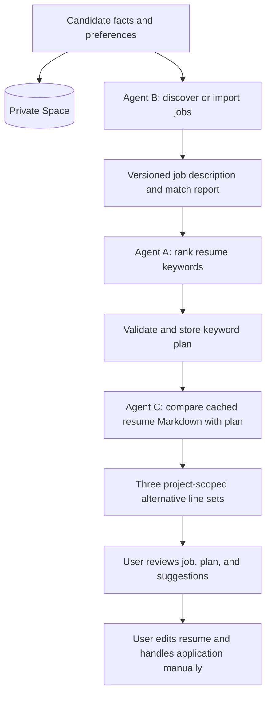

# Job discovery and keyword planning: implementation plan

Status: current scope is profile management, job discovery/import, matching, keyword planning, and manual resume-line suggestions. Agent C maintains one active private `resume.tex`/`resume.md` pair, converts each new source once through its local stdio MCP, and enforces a provider privacy gate; personal resume text remains unavailable to the model until provider handling and retention are explicitly approved. Application form preparation, browser filling, uploads, and submission are outside the approved scope.
Prepared: 2026-09-23; scope updated 2026-09-27.

See [IMPLEMENTATION_TASK_LIST.md](./IMPLEMENTATION_TASK_LIST.md) for implementation status and remaining work.

## 1. Objective

Build a local assistant that helps the user maintain a factual candidate profile, find suitable jobs, explain match decisions, preserve job descriptions, create ranked job-specific keyword plans, and suggest evidence-grounded resume lines for the user's manual editing. The user remains responsible for choosing and editing resume content and for sending applications.

Precision, factual integrity, and the user's explicit preferences take priority over application volume. Match scores are internal heuristics, not predictions of employer ranking. Do not promise ATS scores, interviews, or hiring outcomes.

## 2. Candidate inputs and privacy

Candidate facts and evidence may include role history, dates, responsibilities, projects, tools, outcomes, education, certifications, and portfolio links. Keep them in private storage with provenance and confirmation state. Unknown or conflicting facts remain unresolved; model confidence is not evidence.

Do not commit resumes, contact details, compensation, credentials, browser sessions, or private artifacts. Use synthetic or redacted fixtures. Review provider data handling before sending personal data to a model.

## 3. Workflow

```mermaid
flowchart TD
    U[Candidate facts and preferences] --> S[(Private Space)]
    U --> B[Agent B: discover or import jobs]
    B --> J[Versioned job description and match report]
    J --> A[Agent A: rank resume keywords]
    A --> V[Validate and store keyword plan]
    V --> C[Agent C: compare cached resume Markdown with plan]
    C --> O[Three project-scoped alternative line sets]
    O --> R[User reviews job, plan, and suggestions]
    R --> E[User edits resume and handles application manually]
```

### Agent B: discover and evaluate

1. Use the current preference version and source capabilities.
2. Import or retrieve job descriptions only through supported, permitted channels; preserve source link and metadata.
3. Extract title, company, location, work mode, experience, qualifications, responsibilities, compensation if stated, dates, and source identifiers. Leave missing data unknown.
4. Preserve the exact description, retrieval time, canonical URL, and content hash. Deduplicate and check explicit hard constraints before ranking preferences.
5. Explain evidence, gaps, unknown requirements, and the decision. Mirror saved jobs into `private/job_reviews/`; the database and immutable artifacts remain authoritative.
6. Hand saved usable descriptions to Agent A for keyword planning.

### Agent A: keyword planning

1. Read the assigned job through MCP and use the active Codex session model to generate a structured plan from the description only.
2. Group terms by skills, tools, platforms, responsibilities, domain, seniority, and ATS-relevant synonyms.
3. Rank terms high/medium/low and mark them mandatory/recommended/optional based on job wording, repetition, and role relevance.
4. Filter boilerplate and duplicate terms. Keep exact wording and synonyms distinguishable.
5. Validate and save the plan as a private artifact linked to the job, including hashes, counts, warnings, and model metadata.
6. Never open or edit resume files. The user decides which terms truthfully belong in their resume.

### Agent C: resume conversion and keyword suggestions

1. Accept a local `.tex` path through the dedicated MCP. Copy it into the single active private slot at `private/inputs/resume.tex`; when a different source is supplied, replace the old active source and remove its `resume.md` before conversion. Keep both files out of version control and general job artifacts.
2. Convert a newly imported TeX source to clean Markdown once using the active session model through Agent C's gated conversion tools. Reuse the single active Markdown for later job tasks. Regenerate the same source only when the user explicitly asks; a different supplied source replaces the active pair and needs its own conversion. Record the active source hash, model/prompt, conversion version, and output hash. The local standard-library CLI remains a fallback and its output can require review.
3. For a job, read only the assigned resume Markdown and that job's saved Agent A keyword-plan artifact. Keep job ID, description hash, and keyword-plan artifact/hash in the result provenance.
4. For every keyword in the plan, produce exactly three distinct line suggestions anchored to exact resume line/section pointers. Suggestions may be hypothetical, including claims not stated in the resume, because the user verifies each before applying it. Name the target section or exact project and keep project claims isolated. Where a suggestion replaces a project line, use a pointer from that same project and keep the rendered suggestion no longer than the pointer line. Consider Skills, Education, and Summary where they fit.
5. Keep projects isolated: no line may combine accomplishments, tools, or evidence from multiple projects. Do not move a line to a different project unless the source explicitly supports that association.
6. Use the resume as context for placement, not a limit on possible wording. Hypothetical claims are allowed in the suggestions; the user checks their accuracy before adding anything to the source resume. Account for every keyword with exactly three concrete line suggestions.
7. Return suggestions for review only. Do not rewrite or save changes to `resume.tex`, and do not claim ATS ranking, interviews, or hiring outcomes. The user selects and applies any edits manually.

The Markdown conversion is the one private active derivative at `private/inputs/resume.md`, not a job-specific copy. Its manifest stores the active source and output hashes; a different source replaces the active pair instead of accumulating resume versions. Job-specific suggestion artifacts belong under the corresponding job review folder and authoritative artifact store and reference the active resume and keyword-plan hashes without embedding unrelated personal data. The MCP server checks `config/models.json` (falling back to the example config) for `approved_for_personal_data_processing`, `personal_data_allowed: true`, and the `resume_keyword_suggestions` allowed stage before revealing resume Markdown to the model or saving model output.

## 4. Matching principles

Separate hard constraints from weighted preferences. Reject known hard-constraint failures with a reason; route unknown critical requirements to review. Report score and evidence coverage separately. Do not silently broaden preferences or award evidence for unknown values.

Initial weights and thresholds are heuristics. Calibrate them using user labels and held-out examples before relying on automatic shortlisting.

## 5. Source boundaries

Discovery, description retrieval, and application activity are separate capabilities. This project currently supports manual import and selected read-only discovery/retrieval adapters. It does not automate employer accounts or application forms. Check current official terms and capabilities before adding a source. Use manual handoff when support or permission is unclear; do not bypass CAPTCHA, access limits, or site restrictions.

## 6. Space and artifacts

Space stores confirmed candidate facts, versioned preferences, job records, immutable description, keyword-plan, and resume-suggestion artifacts, review copies, and audit events. Reusable answer metadata remains private profile data; this project has no application-form consumer for it. One active TeX source and its one current Markdown conversion remain under `private/inputs/`; importing a different source replaces them. Each job's suggestions are versioned artifacts linked to the active resume, conversion, description, and keyword-plan hashes at creation time.

All artifacts should retain provenance, hashes, and relevant input versions. Corrections must not rewrite historical records. Generated `private/job_reviews/` files are a convenience view, not a source of truth.

## 7. Current implementation sequence

| Phase | Work | Status |
| --- | --- | --- |
| 00–03 | Scope decisions, contracts, agent packages, Space/profile | Complete |
| 04 | MCP services and model routing | Partial/in progress |
| 05–05G | Agent B import, discovery, matching, review workspace, URL fetch | Implemented with documented gaps |
| 06 | Agent A keyword planning and persistence | Complete |
| 07 | Reusable answer metadata and question primitives | Implemented as Space utilities; no application workflow |
| 08 | Agent C resume conversion cache and project-scoped keyword suggestions | Implemented; model access awaits explicit provider/privacy approval and synthetic workflow checks |

Further work should improve this discovery and keyword-planning product. Application preparation, employer contact, application submission, browser automation, and recurring schedules are outside current scope.

## 8. Quality checks

- Candidate claims are never fabricated or inferred from job descriptions.
- Hard-filter failures do not pass as suitable matches; unknowns remain explicit.
- Duplicate and cross-source job signals are visible.
- Keyword plans match the correct description hash, avoid boilerplate and stuffing, and carry clear priorities.
- Prompt-injection text in a job description cannot change system policy or access unrelated private data.
- Metrics distinguish measured results from targets and explain sample size and limitations.
